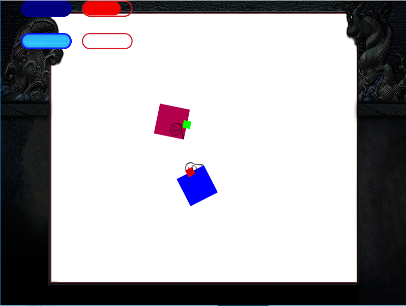

# Whiplash
Многопользовательская Realtime-game. Дано прямоугольное поле, на котором изначально хаотичным образом размещены два квадрата разных цветов. У каждого квадрата есть плетка, для удара, ее необходимо какое-то время раскручивать. Ударив несколько раз плетью в квадрат с другим цветом, можно перекрасить его в свой цвет. Цель каждого квадрата сохранить свой цвет, игра заканчивается когда квадраты становятся одного цвета.

# Запуск игры
* Собранный проект
 * Windows dist/Whiplash-Windows.zip
 * Linux dist/Whiplash-Linux.zip
 * Mac OS dist/Whiplash-MacOSX.zi
 * Android текущая версия еще не портирована

* Сборка из исходников
 1. Скачать jmonkeyengine http://jmonkeyengine.org/
 2. Собрать проект (нажать кнопку Build)
 3. Начать играть (нажать кнопку Run)

# Как играть
Необходимо управлять квадратом и как можно быстрее бить противника плеткой, пока он не станет твоего цвета

# Управление
* WASD - перемещение кубика
* Mouse movement - поворот кубика вокруг своей оси
* Left mouse button - раскручивание и удар плеткой
